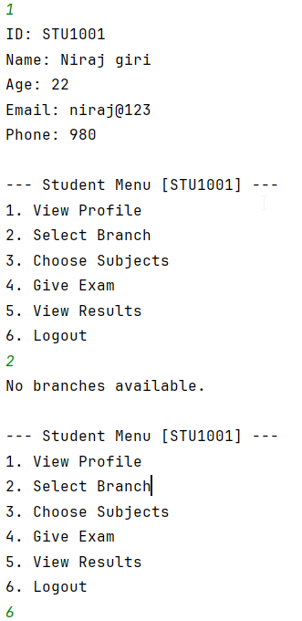
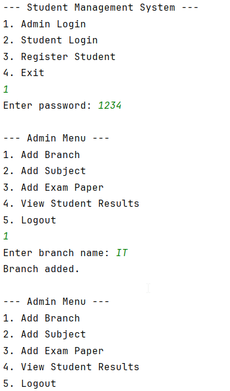
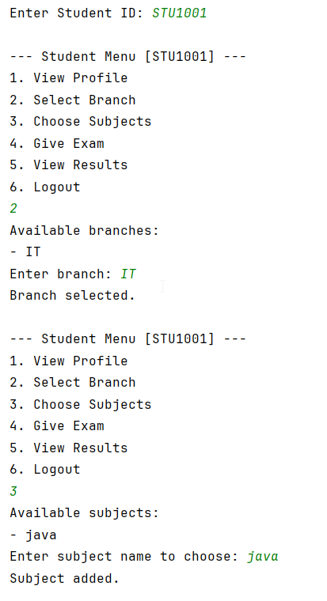
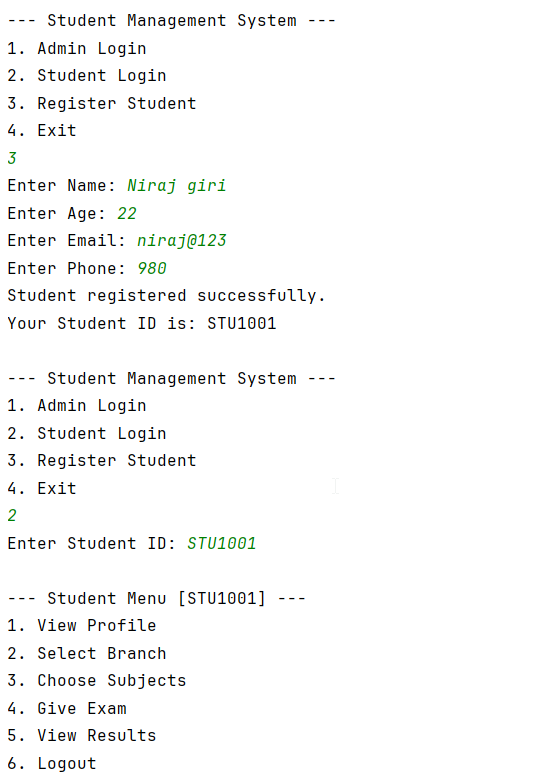
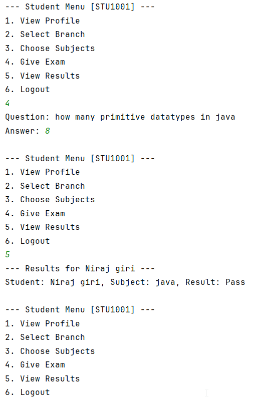
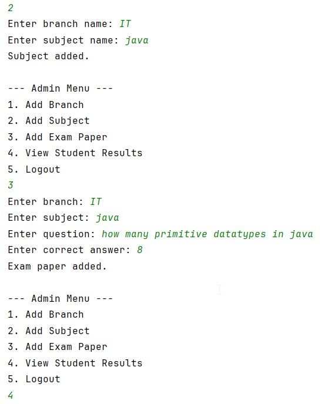

# 🏫 Student Management System – Java (OOP CLI Project)

A Java-based command-line **Student Management System** using core **Object-Oriented Programming (OOP)** concepts. The system has two modules: **Admin** and **Student**. Admin can manage branches, subjects, and exams. Students can register, select subjects, take exams, and view results.

---

## ✅ Features

### 👨‍🏫 Admin Module
- Admin login using a password
- Add branches
- Add subjects to branches
- Add exam papers (questions and answers)
- View all student results

### 👨‍🎓 Student Module
- Register with name, age, email, and phone
- System generates a unique Student ID
- Login using Student ID
- View personal profile
- Select a branch
- Choose subjects from the selected branch
- Take exams based on selected subjects
- View results

---

## ⚙️ Non-Functional Requirements
- Text-based **command-line interface (CLI)**
- Modular and maintainable code using **Java OOPs** principles

---

## 🔁 OOP Concepts Used

| Concept        | Usage                                                                   |
|----------------|-------------------------------------------------------------------------|
| Encapsulation  | All class variables are private and accessed via getters/setters        |
| Inheritance    | `Admin` and `Student` inherit from the abstract `User` class            |
| Polymorphism   | Method overriding for `menu()` in `Admin` and `Student` classes         |
| Abstraction    | Abstract class `User` defines common structure for user types           |

---

## 🧱 Class Structure and Responsibilities

- **User (abstract)**  
  Base class for Admin and Student. Holds shared attributes like name and defines the `menu()` method.

- **Admin extends User**  
  Handles login, branch/subject management, exam creation, and result viewing.

- **Student extends User**  
  Stores student personal info and ID; manages academic activities like subject selection and exam participation.

- **Branch**  
  Represents a department (e.g., IT, CSE); contains a list of subjects.

- **Subject**  
  Represents a subject under a branch. Can have an associated `ExamPaper`.

- **ExamPaper**  
  Holds a single question and the correct answer.

- **Result**  
  Static class that stores and displays exam outcomes.

---

## 🔄 Application Flow

### 🏁 Main Menu (from `Main.java`)
Admin Login

Student Login

Register Student

Exit

### 👨‍🏫 Admin Flow
- Enter password to login
- Choose from options to:
  - Add branch
  - Add subjects
  - Add exam papers
  - View all student results

### 👨‍🎓 Student Flow
- Register with name, age, email, phone
- System generates a unique **Student ID**
- Login using that Student ID
- Menu includes:
  - View profile
  - Select branch
  - Choose subjects
  - Take exams
  - View results

---

## 📸 Screenshots

### 🧑‍🎓 Student Registration

### 📝 Admin Adding Branch and Subjects

### 📚 Student Choosing Subjects

### ❓ Exam Question Prompt

### 📄 Result Output

### 🔐 Admin Viewing All Results

---

## 🚀 Future Enhancements

- File or database persistence
- Multiple questions per subject
- Student password login system
- Grading system with marks

---

## 🧠 Conclusion

This project is a simple yet complete example of applying OOP in a real-world Java CLI application. It 
